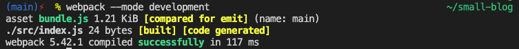

# small-blog

used:
- asynchronous event-driven JavaScript runtime - `Node.js`;
- static module bundler for JavaScript applications - `webpack`;
- JavaScript compiler - `Babel`;  

## steps
### 1. getting started
Architecture - **modules**, each of which will be responsible for its own functionality, so that we can decompose the code and manage it easier. We'll bundler all this modules with the help of `webpack` and compile them into one file. We'll use ES6 and for this application to work in all browsers, we need to install `Babel` so that we recompile our JS into the old format(cross-browser compatibility). Also we will have a local server.

1) Working with a file package.json (basic configuration of our application)
check if Node.js works on our computer:
```
$ node -v && npm -v
```
create package.json file:
```
$ npm init
```
### 2. setting up `webpack`
We already have a file `package.json` where we can write the dependencies our application.

1. install webpack (we need 3 packages):
```
$ npm install webpack webpack-dev-server webpack-cli -D
```
where `-D` tells `npm` that these packages need to be installed as dependencies for development; `node_modules` folder is generated automatically based on `package.json` file; to generate this folder based on a `package.json` file is enough to run `$ npm i`;

in the root of the project, create a new configuration file for `webpack` - `webpack.config.js` (we are on top of Node.js here);

first we need to export an object:
```
module.exports = {
    // specify the entry point of our application
    entry: ['./src/index.js'],
    // indicate where to put what will webpack collect
    output: {
        path: __dirname + '/dist',
        // bundle.js -  it is customary to call the entire set of scripts and modules that we create
        filename: 'bundle.js'
    }
}
```
now we can test current `webpack` or build the project (file `bundle.js` will appear in `dist/`):
```
$ webpack --mode development
```

if  an error like `zsh: command not found: webpack` occures, then this can help:
```
$ echo 'export PATH="./node_modules/.bin:$PATH"' >> ~/.zshrc
$ source ~/.zshrc
```
or (install everything globally):
```
$ npm i -g webpack webpack-dev-server webpack-cli
```


2. next we need to configure the server for development
```
module.exports = {
    // specify the entry point of our application
    entry: ['./src/index.js'],
    // indicate where to put what will webpack collect
    output: {
        path: __dirname + '/dist',
        // bundle.js -  it is customary to call the entire set of scripts and modules that we create
        filename: 'bundle.js'
    },
    devServer: {
        // path to the folder where we'll run the server
        // we put everything that will turn out as a result of compilation into a folder dist/
        contentBase: __dirname + '/dist'
    }
}
```
install `html-webpack-plugin` (so that we can manipulate `index.html` by automatically adding the name of the script):
https://github.com/jantimon/html-webpack-plugin
```
$ npm i --save-dev html-webpack-plugin
```
finally:
```
const HTMLPlugin = require('html-webpack-plugin');

module.exports = {
    // specify the entry point of our application
    entry: ['./src/index.js'],
    // indicate where to put what will webpack collect
    output: {
        path: __dirname + '/dist',
        // bundle.js -  it is customary to call the entire set of scripts and modules that we create
        filename: 'bundle.js'
    },
    devServer: {
        // path to the folder where we'll run the server
        // we put everything that will turn out as a result of compilation into a folder dist/
        contentBase: __dirname + '/dist'
    },
    // to add plugin to webpack we have 'plugins' field
    plugins: [
        // create an instance of the class HTMLPlugin
        new HTMLPlugin({
            // to the class constructor we pass the object
            filename: 'index.html',
            template: './src/index.html'
        })
    ],
    // so that every time we don't write a .js when connecting files
    resolve: {
        extensions: ['.js']
    }
};
```
delete `/dist/bundle.js` and run `$ webpack --mode production`

3. modify `package.json`:
```
"scripts": {
    "build": "webpack --mode production",
    "dev": "webpack --mode development",
    "start": "webpack serve --mode development --open"
  }
```